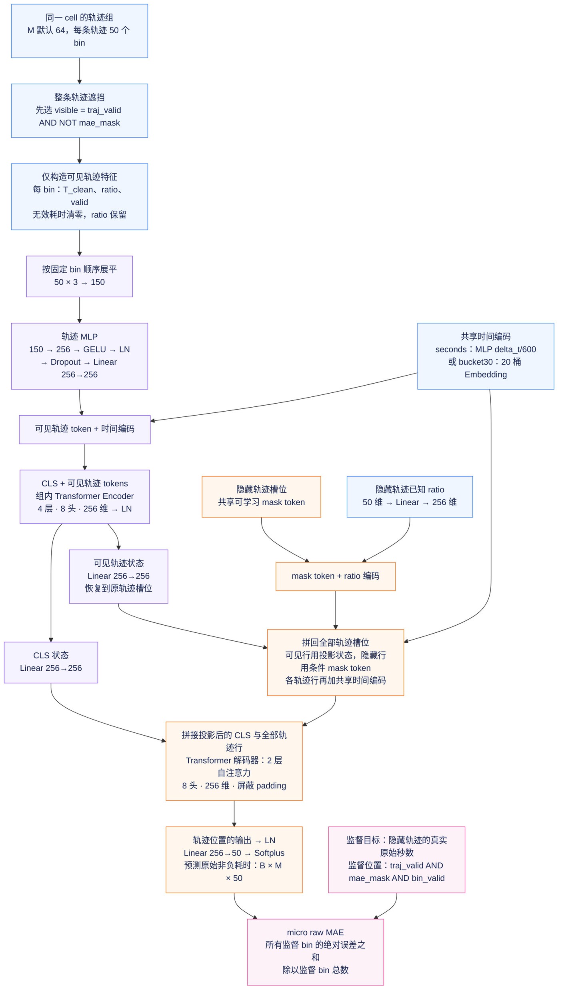

# Trajectory MLP MAE 模型结构

适用目录：`experiments/trajectory_mlp_v1`。此前根目录 `outputs/model_structure/Cell_MAE_*` 文件描述另一套主线模型，不能用于本实验。

依据：[模型](../../model.py)、[数据读取](../../data.py)、[损失](../../evaluation.py)。

隐藏轨迹的耗时与有效性只用于损失；其已知 ratio 和进入时间可以作为解码条件。没有逐 bin Transformer、group_bin 分支或 log-Huber 目标。

文件检查：draw.io XML 和连线引用、XMind ZIP 和 JSON 均已验证；未在桌面编辑器中实际打开。
